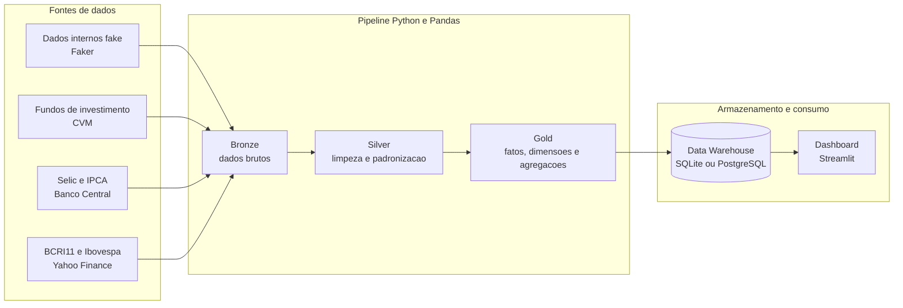

# Arquitetura do projeto de BI

## Visao geral

O projeto integra dados internos simulados e fontes publicas em um pipeline analitico
baseado na arquitetura medalhao. Os dados tratados sao carregados em um Data Warehouse
dimensional, utilizado como fonte principal do dashboard Streamlit.



## Fluxo dos dados

| Etapa | Responsabilidade | Saida principal |
|---|---|---|
| Ingestao | Gerar os dados internos e obter dados da CVM, Banco Central e Yahoo Finance | Arquivos brutos |
| Bronze | Preservar os dados no formato mais proximo possivel das fontes | `data/bronze` |
| Silver | Limpar, tipar, filtrar, normalizar identificadores e tratar valores ausentes | `data/silver` |
| Gold | Criar dimensoes, fatos, indicadores e agregacoes para as perguntas de negocio | `data/gold` |
| Data Warehouse | Centralizar e disponibilizar as tabelas analiticas em um banco relacional | `warehouse/bi_fundos.sqlite` ou PostgreSQL |
| Dashboard | Consultar o Data Warehouse e apresentar as respostas das dez questoes | Aplicacao Streamlit |

## Fontes de dados

### Fonte interna

O modulo `src/fake_internal.py` utiliza Faker para gerar clientes, contas, fundos e
transacoes. A semente configurada torna os resultados reproduziveis.

### Fontes publicas

- CVM: cadastro, patrimonio, aplicacoes, resgates, cotistas e valor das cotas.
- Banco Central: series historicas da Selic e do IPCA.
- Yahoo Finance: cotacoes do BCRI11 e do Ibovespa.

## Arquitetura medalhao

### Bronze

Armazena os arquivos originais ou gerados sem aplicar regras analiticas. Essa camada
permite rastrear a origem dos dados e repetir o tratamento sem baixar novamente todas
as fontes.

### Silver

Concentra os dados limpos e padronizados. Nessa etapa sao tratados tipos, datas,
identificadores de fundos, registros invalidos, duplicidades e nomes ausentes.

### Gold

Contem dados dimensionais e tabelas agregadas no nivel exigido pelos graficos. Essa
camada e carregada no Data Warehouse para consumo pelo dashboard Streamlit.

## Data Warehouse

O Data Warehouse e a fonte analitica oficial do dashboard. O pipeline usa SQLAlchemy
para carregar as tabelas Gold no SQLite ou no PostgreSQL, conforme a
`WAREHOUSE_URL`.

O modelo dimensional inclui:

- `dim_date`: calendario para analises temporais.
- `dim_customer`: clientes, perfil e localizacao.
- `dim_fund`: fundos, tipos e faixas de risco.
- `fact_transactions`: aplicacoes, resgates e captacao liquida.
- `fact_public_fund_monthly`: desempenho mensal dos fundos publicos.
- `fact_macro_monthly`: Selic e IPCA.
- `fact_market_monthly`: BCRI11 e Ibovespa.

As tabelas `gold_*` armazenadas no mesmo banco representam visoes analiticas
achatadas para os graficos. O modelo completo esta em `docs/dbdiagram.dbml`.

## Camada de apresentacao

O `app.py` consulta as tabelas `gold_*` do Data Warehouse e organiza as dez
analises em cinco abas. A barra lateral informa se a fonte ativa e SQLite ou
PostgreSQL. Os CSVs da camada Gold sao usados apenas como contingencia quando o
warehouse esta indisponivel.

## Execucao

```powershell
pip install -r requirements.txt
python -m src.pipeline
streamlit run app.py
```

O fluxo apresentado durante a demonstracao deve ser:

```text
Fontes -> Bronze -> Silver -> Gold -> Data Warehouse -> Dashboard
```
