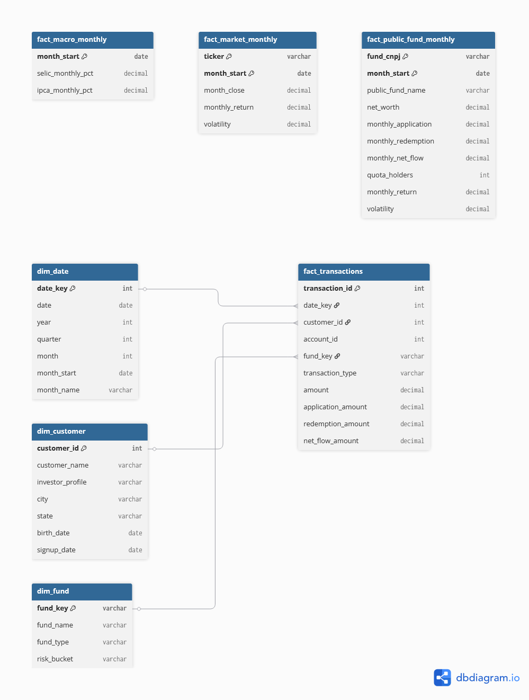

# Projeto de Business Intelligence para Gestão de Fundos de Investimento

**Universidade Federal do Espírito Santo - Centro Tecnológico**  
**Departamento de Informática**  
**Disciplina:** INF17411 - Business Intelligence e Gestão Baseada em Dados  
**Professora:** Camila Zacché de Aguiar  
**Período:** 2026/1  
**Local:** Vitória - ES  

---

## Resumo

Este relatório apresenta a concepção, a modelagem e a implementação de uma solução de
Business Intelligence aplicada à gestão de fundos de investimento. O projeto integra
uma fonte interna simulada, composta por clientes, contas, produtos e movimentações,
com dados públicos da Comissão de Valores Mobiliários (CVM), do Banco Central do Brasil
e do mercado financeiro.

O processamento foi implementado em Python e Pandas segundo uma arquitetura medalhão,
com camadas Bronze, Silver e Gold. As informações tratadas são carregadas em um Data
Warehouse SQLite, com possibilidade de utilização do PostgreSQL, e consumidas por um
dashboard desenvolvido em Streamlit. O resultado é uma base analítica reproduzível,
capaz de apoiar análises de patrimônio, rentabilidade, captação, perfil dos
investidores, localização, indicadores macroeconômicos e relação entre risco e
retorno.

**Palavras-chave:** Business Intelligence; Data Warehouse; fundos de investimento;
arquitetura medalhão; Streamlit; Python.

---

## Sumário

1. [Introdução e cenário](#1-introdução-e-cenário)
2. [Objetivos e escopo](#2-objetivos-e-escopo)
3. [Fontes de dados](#3-fontes-de-dados)
4. [Dicionário de dados](#4-dicionário-de-dados)
5. [Questões de análise](#5-questões-de-análise)
6. [Modelo multidimensional](#6-modelo-multidimensional)
7. [Ferramentas utilizadas](#7-ferramentas-utilizadas)
8. [Arquitetura e pipeline de dados](#8-arquitetura-e-pipeline-de-dados)
9. [Ingestão, tratamento e carga do Data Warehouse](#9-ingestão-tratamento-e-carga-do-data-warehouse)
10. [Dashboard](#10-dashboard)
11. [Limitações e trabalhos futuros](#11-limitações-e-trabalhos-futuros)
12. [Conclusão](#12-conclusão)
13. [Referências](#13-referências)

---

## 1. Introdução e cenário

A Banestes Asset atua na administração fiduciária e na gestão de fundos de
investimento distribuídos pelo Banestes S.A., além de realizar a gestão do Fundo de
Investimento Imobiliário BCRI11, negociado em bolsa. A atividade de gestão é
influenciada tanto pelas características dos clientes e produtos quanto pelo ambiente
econômico.

Entre os fatores externos relevantes estão a taxa Selic, a inflação medida pelo IPCA e
o comportamento dos índices de mercado. Internamente, a empresa necessita acompanhar
clientes, perfis de risco, aplicações, resgates, captação líquida, rentabilidade e
patrimônio dos fundos.

O cenário proposto considera que essas informações se encontram dispersas entre
sistemas, arquivos e fontes públicas. A solução de BI foi construída para integrar
esses dados e disponibilizá-los em uma estrutura única, histórica e apropriada para
análise gerencial.

## 2. Objetivos e escopo

### 2.1 Objetivo geral

Desenvolver um projeto completo de Business Intelligence para integrar dados internos
e públicos relacionados a fundos de investimento, transformando-os em informações
analíticas capazes de apoiar decisões sobre desempenho, captação, perfil dos
investidores e influência do cenário econômico.

### 2.2 Objetivos específicos

- Criar uma fonte interna simulada, coerente e reproduzível.
- Obter e explorar fontes públicas relacionadas a fundos e indicadores econômicos.
- Implementar ingestão e tratamento segundo a arquitetura Bronze, Silver e Gold.
- Elaborar um modelo multidimensional com fatos, dimensões e data marts.
- Carregar os dados tratados em um Data Warehouse.
- Definir dez questões gerenciais e as métricas necessárias para respondê-las.
- Disponibilizar as análises em um dashboard Streamlit.

### 2.3 Recorte adotado

O período configurado compreende janeiro de 2021 a dezembro de 2026. Como 2026 ainda
está em andamento, as fontes públicas possuem observações até julho de 2026, enquanto
a fonte interna fake e a dimensão de datas abrangem todo o ano configurado. A fonte
interna simulada possui:

| Entidade | Quantidade |
|---|---:|
| Clientes | 900 |
| Contas | 1.100 |
| Fundos internos | 4 |
| Movimentações | 14.000 |

Para controlar o consumo de memória, a ingestão da CVM seleciona os 80 fundos com
maior patrimônio líquido no mês de referência mais recente. No processamento atual
foram carregadas 102.590 observações diárias para esses fundos.

## 3. Fontes de dados

### 3.1 Fonte interna simulada

A fonte interna foi criada com a biblioteca Faker e complementada com regras de
negócio implementadas em Python. A semente `20261` garante que uma execução com a
mesma configuração produza dados reproduzíveis.

Foram simuladas quatro entidades:

- **Clientes:** nome, perfil de risco, cidade, estado e datas cadastrais.
- **Contas:** relacionamento com clientes, data de abertura e canal.
- **Fundos:** produto, tipo e faixa de risco.
- **Movimentações:** aplicações e resgates associados a conta, cliente e fundo.

A escolha do fundo é influenciada pelo perfil do investidor. Clientes conservadores
possuem maior probabilidade de aplicar em renda fixa, enquanto clientes arrojados têm
maior peso em fundos de ações. Essa regra torna a fonte fake adequada para analisar o
relacionamento entre perfil e produto.

**Quadro 1 - Recorte do cadastro interno de fundos**

| fund_key | fund_name | fund_type | risk_bucket | ticker |
|---|---|---|---|---|
| RF_CONSERVADOR | Fundo Renda Fixa Conservador | Renda Fixa | Baixo | |
| MULTI_MACRO | Fundo Multimercado Macro | Multimercado | Médio | |
| ACOES_BRASIL | Fundo Ações Brasil | Ações | Alto | |
| IMOB_FII | Fundo Imobiliário BCRI11 | FII | Médio-alto | BCRI11.SA |

**Quadro 2 - Recorte das movimentações internas**

| transaction_id | account_id | customer_id | fund_key | transaction_date | transaction_type | amount |
|---:|---:|---:|---|---|---|---:|
| 1 | 279 | 253 | IMOB_FII | 2022-04-05 | Aplicação | 6.682,37 |
| 2 | 408 | 758 | RF_CONSERVADOR | 2021-11-16 | Aplicação | 1.229,78 |
| 3 | 833 | 206 | RF_CONSERVADOR | 2021-03-05 | Resgate | 4.853,40 |

Os nomes presentes nessa fonte são inteiramente sintéticos. Nenhum dado pessoal real
foi utilizado.

### 3.2 Comissão de Valores Mobiliários

Os informes diários de fundos e o cadastro cadastral são obtidos no Portal de Dados
Abertos da CVM. Os arquivos mensais contêm dados de patrimônio, valor da cota,
aplicações, resgates e quantidade de cotistas.

O perfil exploratório da fonte apresentou:

| Característica | Resultado |
|---|---|
| Período disponível | 04/01/2021 a 13/07/2026 |
| Fundos selecionados | 80 |
| Observações diárias filtradas | 102.590 |
| Fundos com denominação válida na Gold | 18 |
| Cadastro CVM | 46.808 registros antes do filtro |

**Quadro 3 - Recorte dos informes da CVM após padronização**

| fund_cnpj | date | share_value | net_worth | daily_application | daily_redemption | quota_holders |
|---|---|---:|---:|---:|---:|---:|
| 00.083.181/0001-67 | 2021-01-04 | 701,02271134 | 16.337.242.387,53 | 0,00 | 0,00 | 4 |
| 00.083.181/0001-67 | 2021-01-05 | 701,49668255 | 16.348.288.224,62 | 0,00 | 0,00 | 4 |
| 00.083.181/0001-67 | 2021-01-06 | 691,65236546 | 16.118.867.705,24 | 0,00 | 0,00 | 4 |

O cadastro de fundos é utilizado para associar o CNPJ à denominação social. Registros
sem nome real ou cujo nome contém apenas o próprio CNPJ são excluídos da camada Gold,
evitando rótulos inadequados no dashboard.

### 3.3 Banco Central do Brasil

Os indicadores macroeconômicos são obtidos pela API SGS do Banco Central:

- Série 11: taxa Selic diária.
- Série 433: IPCA mensal.

As séries possuem calendários diferentes e são combinadas por data com junção
externa, preservando todas as observações. O conjunto processado possui 1.416 linhas,
entre 01/01/2021 e 15/07/2026.

**Quadro 4 - Recorte das séries macroeconômicas**

| date | selic_daily_pct | ipca_monthly_pct | month |
|---|---:|---:|---|
| 2021-01-01 | | 0,25 | 2021-01-01 |
| 2021-01-04 | 0,007469 | | 2021-01-01 |
| 2021-01-05 | 0,007469 | | 2021-01-01 |
| 2021-01-06 | 0,007469 | | 2021-01-01 |

### 3.4 Dados de mercado

O projeto utiliza o yfinance para solicitar os fechamentos ajustados de `BCRI11.SA` e
`^BVSP`. A finalidade é calcular retorno mensal, volatilidade e índices acumulados de
base 100.

Na exploração registrada durante o desenvolvimento, essa requisição retornou zero
linhas. O pipeline e o esquema analítico estão preparados para a fonte, mas uma nova
execução bem-sucedida é necessária para preencher a comparação BCRI11 versus
Ibovespa antes da captura definitiva do dashboard.

## 4. Dicionário de dados

O dicionário completo, com tipos, granularidade e descrição de todas as colunas, está
disponível em `docs/data_dictionary.md`. Esta seção apresenta as estruturas centrais
das fontes e do modelo analítico.

### 4.1 Campos da fonte interna

| Tabela | Chave ou granularidade | Campos principais |
|---|---|---|
| internal_customers | Um cliente por `customer_id` | customer_name, investor_profile, city, state, birth_date, signup_date |
| internal_accounts | Uma conta por `account_id` | customer_id, account_open_date, channel |
| internal_funds | Um produto por `fund_key` | fund_name, fund_type, risk_bucket, ticker |
| internal_transactions | Uma movimentação por `transaction_id` | account_id, customer_id, fund_key, transaction_date, transaction_type, amount |

### 4.2 Campos das fontes externas

| Fonte | Campo original | Significado |
|---|---|---|
| CVM | CNPJ_FUNDO / CNPJ_FUNDO_CLASSE | Identificador do fundo ou classe |
| CVM | DT_COMPTC | Data de competência |
| CVM | VL_QUOTA | Valor da cota |
| CVM | VL_PATRIM_LIQ | Patrimônio líquido |
| CVM | CAPTC_DIA | Aplicação informada no dia |
| CVM | RESG_DIA | Resgate informado no dia |
| CVM | NR_COTST | Quantidade de cotistas |
| BCB | selic_daily_pct | Taxa Selic diária da série SGS 11 |
| BCB | ipca_monthly_pct | IPCA mensal da série SGS 433 |
| Yahoo Finance | close | Fechamento ajustado do ativo |
| Yahoo Finance | ticker | Identificador BCRI11.SA ou ^BVSP |

### 4.3 Tabelas dimensionais e fatos

| Tabela | Granularidade | Finalidade |
|---|---|---|
| dim_date | Um registro por dia | Calendário para agrupamentos temporais |
| dim_customer | Um registro por cliente | Perfil e localização dos investidores |
| dim_fund | Um registro por fundo interno | Tipo de produto e faixa de risco |
| fact_transactions | Uma movimentação | Aplicações, resgates e captação líquida |
| fact_public_fund_monthly | Um fundo público por mês | Patrimônio, fluxo, retorno e volatilidade |
| fact_macro_monthly | Um registro por mês | Selic e IPCA |
| fact_market_monthly | Um ativo por mês | Fechamento, retorno e volatilidade |

### 4.4 Data marts do Streamlit

| Tabela | Conteúdo analítico |
|---|---|
| gold_public_funds_monthly | Série mensal e retorno acumulado dos fundos públicos |
| gold_risk_return | Indicadores consolidados de risco e retorno por fundo |
| gold_internal_flows_monthly | Aplicações, resgates e captação por fundo e mês |
| gold_investor_profile_fund_type | Volume por perfil e tipo de fundo |
| gold_city_investment | Volume e investidores por cidade |
| gold_macro_funds_monthly | Selic, IPCA, fluxo de renda fixa e retorno dos fundos |
| gold_market_comparison_monthly | Comparação BCRI11 e Ibovespa |

## 5. Questões de análise

As questões foram definidas para cobrir desempenho, fluxo financeiro, clientes,
geografia, ambiente macroeconômico e risco.

| Nº | Questão | Visualização adotada | Dimensões e medidas |
|---:|---|---|---|
| 1 | Qual foi a evolução mensal do patrimônio líquido por fundo? | Gráfico de linhas | Mês, fundo e patrimônio líquido |
| 2 | Qual fundo teve maior rentabilidade acumulada no período? | Ranking em barras horizontais | Fundo e retorno acumulado |
| 3 | Qual foi o volume mensal de aplicações e resgates? | Barras agrupadas | Mês, aplicações e resgates |
| 4 | Em quais meses houve maior captação líquida? | Ranking em barras horizontais | Mês e captação líquida |
| 5 | Qual perfil de investidor mais aplicou em cada tipo de fundo? | Barras agrupadas | Tipo de fundo, perfil e aplicações |
| 6 | Quais cidades concentram maior volume investido? | Ranking em barras horizontais | Cidade, UF e aplicações |
| 7 | Existe relação entre Selic e captação em fundos de renda fixa? | Linha e barras com dois eixos | Mês, Selic e captação líquida |
| 8 | Existe relação entre IPCA e rentabilidade dos fundos? | Dispersão | IPCA e retorno médio dos fundos |
| 9 | Como o BCRI11 se comportou em comparação ao Ibovespa? | Linhas em índice base 100 | Mês e índices acumulados |
| 10 | Quais fundos tiveram melhor relação entre rentabilidade e risco? | Dispersão com tamanho por patrimônio | Volatilidade, retorno e patrimônio |

As análises 7 e 8 permitem observar associação visual e não devem ser interpretadas,
isoladamente, como evidência de causalidade.

## 6. Modelo multidimensional

O modelo segue uma constelação de fatos. O processo interno utiliza dimensões
compartilhadas de data, cliente e fundo. Os dados públicos possuem fatos mensais
específicos para fundos, macroeconomia e mercado.



**Figura 1 - Modelo dimensional do projeto**

### 6.1 Dimensões

- **dim_date:** data, ano, trimestre, mês e primeiro dia do mês.
- **dim_customer:** cliente, perfil do investidor e localização.
- **dim_fund:** fundo interno, tipo e faixa de risco.

### 6.2 Fatos

- **fact_transactions:** granularidade de uma movimentação, com valores de aplicação,
  resgate e captação líquida.
- **fact_public_fund_monthly:** granularidade de um fundo público por mês.
- **fact_macro_monthly:** granularidade mensal para Selic e IPCA.
- **fact_market_monthly:** granularidade de um ativo por mês.

### 6.3 Medidas derivadas

As principais medidas são calculadas da seguinte forma:

```text
application_amount = amount, quando transaction_type = "Aplicacao"
redemption_amount  = amount, quando transaction_type = "Resgate"
net_flow_amount    = application_amount - redemption_amount

monthly_return = produto(1 + daily_return) - 1
volatility     = desvio_padrao(daily_return)

return_risk_ratio = accumulated_return / avg_daily_volatility
```

O arquivo-fonte atualizado do modelo encontra-se em `docs/dbdiagram.dbml`. As chaves
do DBML representam o modelo lógico. A carga atual realizada pelo Pandas recria as
tabelas sem aplicar fisicamente todas as restrições de chave.

## 7. Ferramentas utilizadas

| Ferramenta | Papel no projeto | Justificativa |
|---|---|---|
| Python 3.11+ | Linguagem principal | Ecossistema adequado para engenharia e análise de dados |
| Pandas | Ingestão, limpeza e agregação | Operações tabulares e tratamento de séries temporais |
| Faker | Geração da fonte interna | Dados sintéticos reproduzíveis sem exposição de dados reais |
| Requests | Consumo das APIs públicas | Requisições HTTP para CVM e Banco Central |
| yfinance | Dados de mercado | Interface para cotações do BCRI11 e Ibovespa |
| NumPy | Cálculos vetorizados | Medidas condicionais e tratamento numérico |
| SQLAlchemy | Carga e consulta do warehouse | Compatibilidade com SQLite e PostgreSQL |
| SQLite | Data Warehouse da demonstração | Banco portátil, simples e incluído no repositório de apresentação |
| PostgreSQL | Alternativa de Data Warehouse | Opção para execução em ambiente de servidor |
| Streamlit | Dashboard | Construção rápida de aplicação analítica interativa |
| Plotly | Gráficos | Interatividade, hover, zoom e diferenciação de séries |
| dbdiagram.io / DBML | Modelo dimensional | Documentação visual das tabelas e relacionamentos |
| Ruff | Qualidade do código | Formatação e verificação estática |

## 8. Arquitetura e pipeline de dados

O pipeline segue a arquitetura medalhão:

```text
Fontes internas e públicas
          |
          v
Bronze -> Silver -> Gold -> Data Warehouse -> Streamlit
```

### 8.1 Bronze

A camada Bronze preserva os dados brutos:

- `data/bronze/internal`: CSVs da fonte fake.
- `data/bronze/public/cvm`: arquivos ZIP e CSV originais da CVM.
- Respostas das APIs são mantidas em memória e encaminhadas ao tratamento.

Essa camada permite rastreabilidade e evita novo download dos arquivos da CVM quando
eles já estão disponíveis localmente.

### 8.2 Silver

A camada Silver contém dados limpos e padronizados:

- conversão de datas e valores numéricos;
- normalização de `CNPJ_FUNDO_CLASSE` para `CNPJ_FUNDO`;
- renomeação de colunas para nomes analíticos;
- remoção de registros sem data ou identificador;
- cálculo de retorno diário e captação líquida;
- seleção das colunas necessárias;
- filtro dos fundos de referência.

### 8.3 Gold

A camada Gold contém:

- dimensões e fatos do modelo multidimensional;
- agregações mensais;
- retornos compostos;
- volatilidade;
- índices de base 100;
- data marts específicos para cada grupo de gráficos.

Os DataFrames Gold são gravados em CSV para auditoria e carregados no Data Warehouse.

### 8.4 Data Warehouse e apresentação

O Data Warehouse é a fonte oficial do dashboard. O SQLite utilizado na apresentação
fica em `warehouse/bi_fundos.sqlite`. A mesma aplicação aceita PostgreSQL por meio da
variável `WAREHOUSE_URL`.

O Streamlit consulta as tabelas `gold_*` do banco. Os CSVs são utilizados apenas como
contingência quando o warehouse não está disponível, situação sinalizada na barra
lateral do dashboard.

## 9. Ingestão, tratamento e carga do Data Warehouse

### 9.1 Configuração do ambiente

```powershell
python -m venv .venv
..venvScriptsActivate.ps1
pip install -r requirements.txt
```

O arquivo `.env` define a URL do warehouse:

```dotenv
WAREHOUSE_URL=sqlite:///warehouse/bi_fundos.sqlite
```

### 9.2 Geração da fonte interna

O módulo `src/fake_internal.py`:

1. inicializa Faker, Random e NumPy com a mesma semente;
2. gera os clientes e atribui perfis com pesos definidos;
3. gera contas relacionadas aos clientes;
4. seleciona fundos com pesos dependentes do perfil;
5. gera aplicações e resgates com valores de distribuição lognormal;
6. grava os quatro CSVs na camada Bronze.

Trecho representativo:

```python
fake = Faker("pt_BR")
Faker.seed(config.seed)
random.seed(config.seed)
np.random.seed(config.seed)
```

### 9.3 Ingestão da CVM

O módulo `src/sources_public.py` baixa os informes mensais e o cadastro. Antes de
concatenar o período inteiro, o pipeline:

1. abre o arquivo mensal mais recente disponível;
2. ordena os fundos por `VL_PATRIM_LIQ`;
3. seleciona os maiores CNPJs;
4. lê somente as colunas necessárias de cada arquivo;
5. filtra cada mês antes da concatenação.

Essa estratégia reduziu o volume carregado e evitou o consumo excessivo de memória
observado na primeira versão do pipeline.

### 9.4 Ingestão do Banco Central e mercado

As séries do Banco Central são consultadas com período inicial e final:

```python
fetch_bcb_series(11, "selic_daily_pct", start_date, end_date)
fetch_bcb_series(433, "ipca_monthly_pct", start_date, end_date)
```

As cotações são solicitadas para:

```python
["BCRI11.SA", "^BVSP"]
```

### 9.5 Tratamento Silver

O módulo `src/transform.py` implementa a padronização. Entre as regras aplicadas estão:

- `pd.to_datetime(..., errors="coerce")` para datas;
- `pd.to_numeric(..., errors="coerce")` para medidas;
- cálculo de `date_key` no formato `YYYYMMDD`;
- cálculo de `daily_net_flow`;
- ordenação por fundo e data antes de calcular retornos;
- associação dos nomes do cadastro CVM;
- exclusão de fundos sem denominação válida.

### 9.6 Transformação Gold

Os fatos públicos são agregados por CNPJ e mês. O retorno mensal é composto a partir
dos retornos diários:

```python
lambda s: (1 + s.dropna()).prod() - 1
```

Os data marts do Streamlit são construídos em `src/dashboard_marts.py`. Essa etapa
combina fatos e dimensões para entregar ao dashboard tabelas no nível exato de cada
visualização.

### 9.7 Carga do Data Warehouse

O módulo `src/load_warehouse.py` cria uma engine SQLAlchemy e carrega todas as tabelas
Gold:

```python
engine = create_engine(warehouse_url)
with engine.begin() as connection:
    for table_name, df in tables.items():
        df.to_sql(table_name, connection, if_exists="replace", index=False)
```

O uso de transação garante que cada operação de carga seja controlada pela conexão do
banco. A opção `replace` torna a execução idempotente para fins de demonstração: uma
nova execução substitui a versão anterior das tabelas.

### 9.8 Execução completa

```powershell
python -m src.pipeline --warehouse sqlite:///warehouse/bi_fundos.sqlite
```

Para reduzir o número de fundos públicos:

```powershell
python -m src.pipeline --max-public-funds 30
```

Para iniciar o dashboard:

```powershell
streamlit run app.py
```

Durante a apresentação, a barra lateral deve indicar:

```text
Fonte: Data Warehouse (SQLITE)
```

## 10. Dashboard

> **PENDENTE: inserir nesta seção a imagem final do dashboard Streamlit.**

<!--
Substituir este comentário pela imagem final, por exemplo:


Manter a legenda:
Figura 2 - Dashboard de fundos de investimento desenvolvido em Streamlit.
-->

O dashboard foi organizado em cinco abas:

1. Visão geral.
2. Fundos e captação.
3. Investidores e geografia.
4. Macro x fundos.
5. Mercado, risco e retorno.

Os gráficos utilizam filtros de período, cores distintas para fundos e ativos,
tooltips, zoom e tabelas auxiliares. Os indicadores monetários são apresentados em
formato compacto, mantendo o valor completo no texto de ajuda.

## 11. Limitações e trabalhos futuros

- A fonte interna é sintética e representa um cenário analítico, não o comportamento
  real dos clientes do Banestes.
- A seleção dos maiores fundos reduz o consumo de memória, mas não representa todo o
  universo da CVM.
- A relação visual entre variáveis macroeconômicas e fundos indica associação, não
  causalidade.
- A execução registrada do yfinance não retornou cotações. A coleta deve ser repetida
  antes da captura final do gráfico BCRI11 versus Ibovespa.
- O processo atual substitui as tabelas do warehouse. Uma evolução futura pode adotar
  carga incremental, controle de versão e restrições físicas de integridade.
- O PostgreSQL está previsto e suportado, mas a demonstração utiliza SQLite por sua
  portabilidade.

## 12. Conclusão

O projeto implementa o ciclo completo solicitado para uma solução de Business
Intelligence: definição do escopo, criação de fonte interna, exploração de fontes
públicas, modelagem multidimensional, tratamento em arquitetura medalhão, carga em
Data Warehouse e construção de dashboard.

A integração entre dados transacionais simulados, informações de fundos da CVM e
indicadores do Banco Central permite analisar o desempenho dos fundos sob diferentes
perspectivas. A separação em camadas melhora a rastreabilidade, enquanto o Data
Warehouse centraliza as informações tratadas e estabelece uma fonte única para o
Streamlit.

Além de responder às questões gerenciais propostas, a implementação é reproduzível e
pode ser evoluída para PostgreSQL, novas fontes externas, cargas incrementais e
análises estatísticas mais aprofundadas.

## 13. Referências

- BANCO CENTRAL DO BRASIL. Sistema Gerenciador de Séries Temporais - SGS. Disponível
  em: <https://www3.bcb.gov.br/sgspub/>. Acesso em: 2026.
- COMISSÃO DE VALORES MOBILIÁRIOS. Portal de Dados Abertos da CVM. Disponível em:
  <https://dados.cvm.gov.br/>. Acesso em: 2026.
- DBML. DBML Syntax. Disponível em: <https://dbml.dbdiagram.io/docs/>. Acesso em:
  2026.
- PANDAS. Pandas documentation. Disponível em: <https://pandas.pydata.org/docs/>.
  Acesso em: 2026.
- PLOTLY. Plotly Python Open Source Graphing Library. Disponível em:
  <https://plotly.com/python/>. Acesso em: 2026.
- STREAMLIT. Streamlit documentation. Disponível em:
  <https://docs.streamlit.io/>. Acesso em: 2026.
- YFINANCE. yfinance documentation. Disponível em:
  <https://ranaroussi.github.io/yfinance/>. Acesso em: 2026.

---

**Artefatos complementares**

- `docs/data_dictionary.md`: dicionário de dados completo.
- `docs/dbdiagram.dbml`: modelo multidimensional.
- `docs/architecture.md`: arquitetura técnica.
- `sql/analysis_queries.sql`: consultas correspondentes às dez questões.
- `src/`: código-fonte do pipeline.
- `app.py`: dashboard Streamlit.
